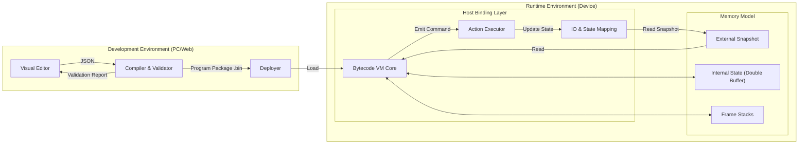
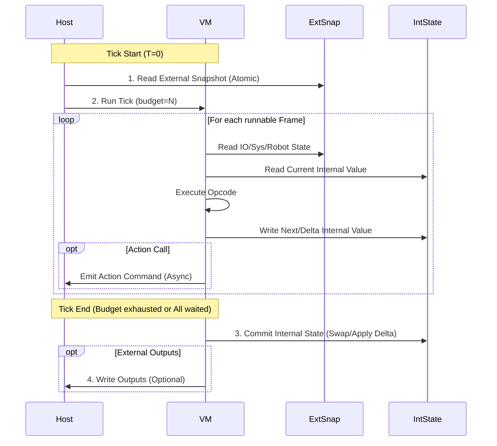

# Bytecode VM Runtime & Compilation Spec v1.0

## 1. 背景与目标 (Background & Objectives)

本规范定义了一套 **基于字节码的逻辑引擎运行时 (Bytecode VM Runtime)** 及其 **编译发布格式**。
目标是确保同一份逻辑程序包 (Program Package) 能够在 **STM32 (C/Bare-Metal)** 和 **树莓派 (C++/Linux)** 两个独立的硬件产品上运行，并表现出完全一致的逻辑行为。

### 核心约束 (Key Constraints)
1.  **跨平台一致性 (Cross-Platform Consistency)**: 逻辑行为仅由 VM 语义决定，硬件差异仅通过 Host Binding 隔离。
2.  **确定性执行 (Deterministic Execution)**: 采用 100Hz Tick 驱动，每 Tick 预算受控，强一致快照输入，原子提交输出。
3.  **无感变量生灭 (Seamless Variable Lifecycle)**: 运行时不支持动态创建/删除变量，所有变量生命周期在编译期确定。
4.  **动作异步化 (Async Actions)**: 动作调用不阻塞 Tick，通过命令队列下发，通过状态变量回传结果。

## 2. 术语表 (Glossary)

| 术语 | 定义 |
| :--- | :--- |
| **Program Package** | 编译后的二进制逻辑包，包含字节码、符号表、常量池等。 |
| **Tick** | 逻辑执行的最小时间片 (默认 10ms)。每个 Tick 完成一次“快照读 -> 逻辑计算 -> 状态提交”。 |
| **External Snapshot** | 外部变量 (IO/System/Robot) 在 Tick 开始时的只读副本，保证 Tick 内数据一致性。 |
| **Internal State** | 内部变量 (Var) 的存储区。分为 Current (本 Tick 读) 和 Next/Delta (本 Tick 写)。 |
| **Frame / Activation** | 类似于线程栈帧，用于保存 PC、Stack 和 WaitSpec。支持多 Frame 并行。 |
| **Host Binding** | VM 与宿主硬件 (Host) 之间的接口层，负责 IO 映射、动作执行、时钟提供。 |
| **Action Command** | VM 发出的动作请求 (如 MoveTo)，异步执行。 |
| **Symbol** | 变量的元数据描述 (ID, Type, StorageClass, Offset)。 |

## 3. 总体架构 (Architecture)



## 4. 语义契约 (Semantic Contract)

### 4.1 Tick 时序 (Tick Sequence)

每个 Tick (10ms) 必须严格遵循以下步骤：



### 4.2 一致性规则 (Consistency Rules)
1.  **Snapshot Isolation**: Tick 内所有读取操作 (LOAD_EXT) 必须返回 Tick 开始时采样的 External Snapshot 值。即使物理 IO 在 Tick 期间发生变化，VM 也不可见，直到下一 Tick。
2.  **Atomic Internal Update**: Tick 内所有写入操作 (STORE_INT) 写入 Next Buffer 或 Delta。Tick 内读取 (LOAD_INT) 始终读取 Current Buffer (即上一 Tick 提交的值)。**不允许同 Tick 写后读 (Read-Your-Writes)**，以简化并行语义并避免顺序依赖。
3.  **Deterministic Schedule**: 并行 Frame 的执行顺序必须固定 (例如按 Frame ID 升序 Round-Robin)，以保证在相同输入序列下，STM32 和树莓派产生完全相同的状态变更序列。

## 5. Program Package 二进制格式 (Binary Format)

所有多字节字段采用 **Little Endian**。

### 5.1 Header (64 bytes)
| Offset | Field | Type | Description |
| :--- | :--- | :--- | :--- |
| 0x00 | magic | u32 | 0x474C4550 ('GLEP') |
| 0x04 | version | u32 | Format version (e.g., 1) |
| 0x08 | crc32 | u32 | Checksum of the rest of the file |
| 0x0C | flags | u32 | Profile flags (e.g., enable_f64) |
| 0x10 | tick_us | u32 | Expected tick period in microseconds |
| 0x14 | section_cnt | u32 | Number of sections |
| 0x18 | reserved | u8[40]| Reserved for future use |

### 5.2 Section Table
紧跟 Header 之后，每个 Entry 16 bytes。
| Field | Type | Description |
| :--- | :--- | :--- |
| type | u32 | 1=SYMBOL, 2=CONST, 3=CODE, 4=DEBUG |
| offset | u32 | File offset |
| length | u32 | Section length in bytes |
| crc | u32 | Section specific checksum |

### 5.3 Symbol Table (Type=1)
描述所有变量元数据。
| Field | Type | Description |
| :--- | :--- | :--- |
| id | u16 | Symbol ID (referenced in bytecode) |
| flags | u8 | 0x01=EXTERNAL, 0x02=READONLY |
| type | u8 | 1=BOOL, 2=I32, 3=F32, 4=STR_REF |
| binding | u32 | EXTERNAL: Host Binding ID / Register Addr<br>INTERNAL: Offset in Internal State Buffer |

### 5.4 Bytecode (Type=3)
紧凑指令流。
- 采用 **Stack Machine** 模型。
- 指令不定长 (Opcode u8 + Operands)。

## 6. 指令集规范 (Opcode Specification)

### 6.1 Data Access
| Opcode | Mnemonic | Stack (Before -> After) | Description |
| :--- | :--- | :--- | :--- |
| 0x01 | PUSH_CONST (id:u16) | [] -> [val] | 从常量池加载值压栈 |
| 0x02 | LOAD_EXT (id:u16) | [] -> [val] | 读取 External Snapshot 值 |
| 0x03 | LOAD_INT (id:u16) | [] -> [val] | 读取 Internal State (Current) 值 |
| 0x04 | STORE_INT (id:u16) | [val] -> [] | 写入 Internal State (Next) 值 |

### 6.2 Arithmetic & Logic
| Opcode | Mnemonic | Stack | Description |
| :--- | :--- | :--- | :--- |
| 0x10 | ADD_I32 | [a, b] -> [a+b] | 整数加法 |
| 0x11 | SUB_I32 | [a, b] -> [a-b] | 整数减法 |
| 0x20 | CMP_EQ | [a, b] -> [bool] | 相等比较 |
| 0x21 | CMP_GT | [a, b] -> [bool] | 大于比较 |
| 0x30 | AND | [a, b] -> [a&b] | 逻辑与 |
| 0x31 | NOT | [a] -> [!a] | 逻辑非 |

### 6.3 Control Flow
| Opcode | Mnemonic | Operands | Description |
| :--- | :--- | :--- | :--- |
| 0x40 | JMP | offset:s16 | 无条件跳转 PC += offset |
| 0x41 | JMP_T | offset:s16 | Pop bool, if true PC += offset |
| 0x42 | JMP_F | offset:s16 | Pop bool, if false PC += offset |
| 0x43 | END | - | 结束当前 Frame (设置为 HALTED) |
| 0x44 | YIELD | - | 主动让出执行权 (Check Budget) |

### 6.4 Async & System
| Opcode | Mnemonic | Operands | Description |
| :--- | :--- | :--- | :--- |
| 0x50 | CALL_ACTION | id:u16, argc:u8 | Pop args, Emit Command, Push ActionHandle |
| 0x51 | WAIT_ACTION | - | Pop ActionHandle, Wait for DONE/ERROR |
| 0x52 | WAIT_EXT | id:u16, cond:u8 | Wait for External Symbol satisfy condition |
| 0x53 | SPAWN | target:u16 | Create new Frame at target PC |

## 7. Host Binding 接口 (Host Interface)

Host 必须实现以下 C 接口供 VM 调用：

```c
// 1. Snapshot Management
void host_read_snapshot(void* buffer, size_t size);
void host_write_outputs(const void* buffer, size_t size);

// 2. Action System
// 返回 handle，Host 需在后续通过 External Vars 反映状态
uint16_t host_emit_command(uint16_t action_id, const void* args, size_t len);

// 3. Time & Log
uint64_t host_get_time_us();
void host_log(uint8_t level, const char* msg);

// 4. Persistence (Optional)
void host_save_internal(const void* buffer, size_t size);
bool host_load_internal(void* buffer, size_t size);
```

## 8. 编译器规则 (Compiler Rules)

### 8.1 预校验 (Pre-Validation)
- **Symbol Existence**: 所有的 LOAD_EXT 引用必须存在于 Host 提供的 Schema 中。
- **Type Safety**: 静态类型检查，禁止隐式转换。
- **Cycle Safety**: 所有循环结构必须包含 `YIELD` 或显式的 `WAIT`，或由编译器插入 MaxIterations 计数器，防止单 Tick 死循环。

### 8.2 变量生灭 (Variable Lifecycle)
- **Definition**: 扫描全图所有的 `STORE_INT` 指令，收集所有 Internal Symbols。
- **Initialization**: 对于所有 Internal Symbols，在 Program Start 处插入初始化指令 (默认 0/false)。
- **Hard Delete**: 若图中删除了某个变量的所有写入点，编译器不再生成该 Symbol Entry。运行时若加载旧的持久化数据，多余数据将被丢弃。

### 8.3 动作编译 (Action Compilation)
High-level Action Node: `MoveTo(p1, p2)` 编译为:
```asm
PUSH_CONST p1
PUSH_CONST p2
CALL_ACTION ID_MOVE_TO, 2  ; Stack: [handle]
WAIT_ACTION                ; Stack: [] (Blocks until Host reports DONE)
```

### 8.4 状态机与算法实现
关于状态机的具体编译模式、运行时分发算法以及双缓冲机制的详细实现原理，请移步至专门的技术文档：
[Graph Logic Engine Implementation Principles & Algorithms](./graph-logic-engine-impl.md)

## 9. 测试与验证 (Verification)

### 9.1 Golden Trace Test
- **输入**: Program Package + 序列化的一组 External Snapshots (T=0..N)。
- **期望输出**: 每一 Tick 的 Internal State Hash + Action Command 序列。
- **方法**:
    1. 在 PC 上运行 VM，生成 Golden Output。
    2. 在 STM32 和 树莓派 上运行同一测试，对比 Output 是否字节级一致。

### 9.2 WCET 分析
- 统计每种 Opcode 的最大执行时间。
- 在 STM32 (裸机) 上监控 Tick 执行时长，确保不超过 10ms (Budget Margin > 20%)，并需考虑中断服务程序的抢占影响。
