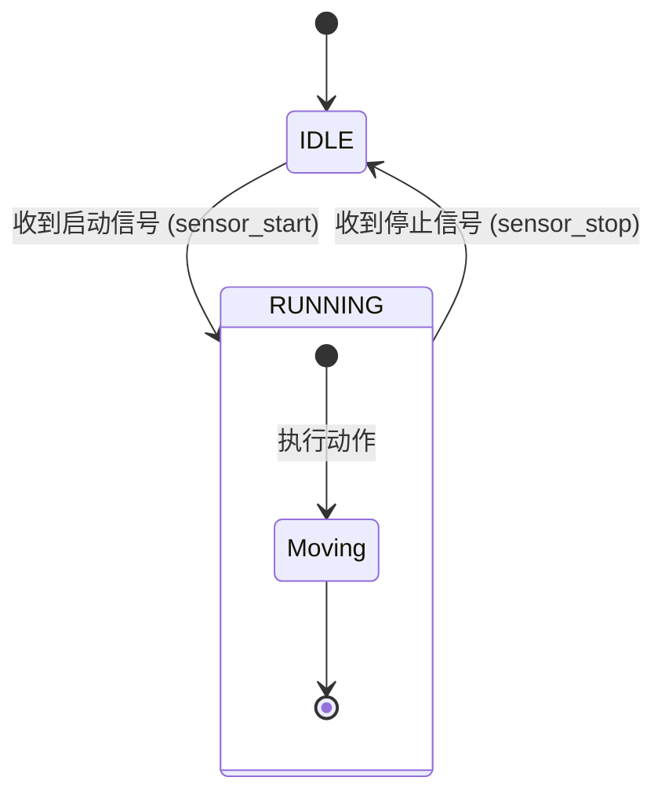
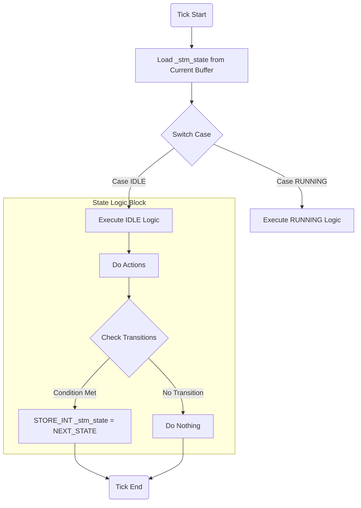
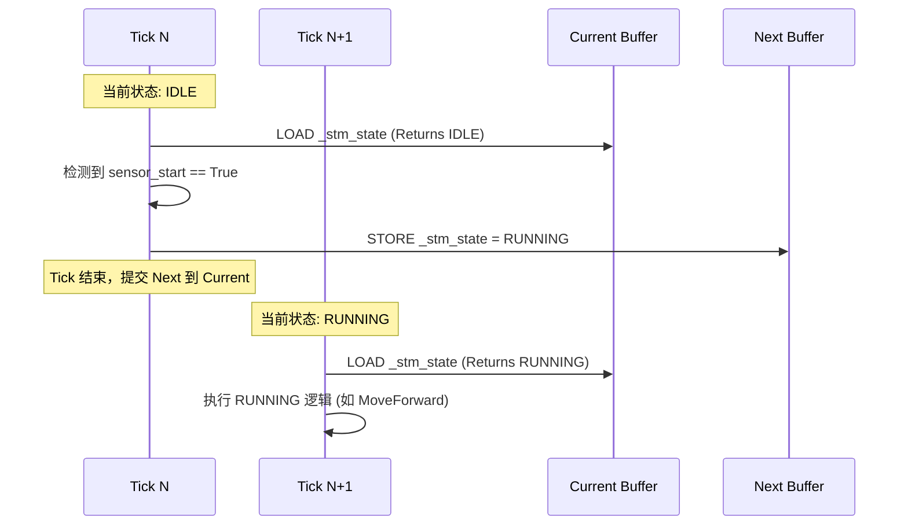
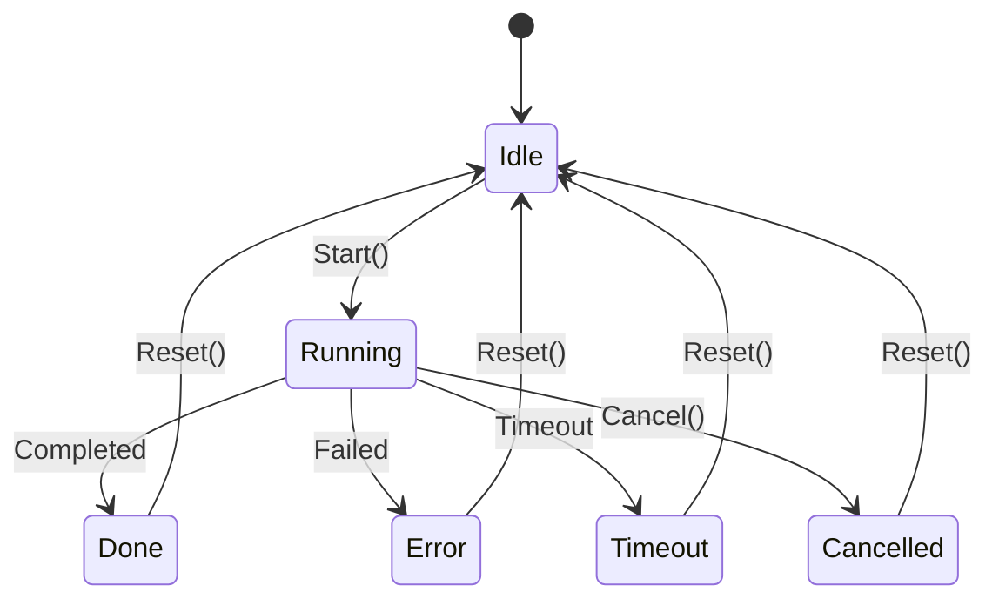
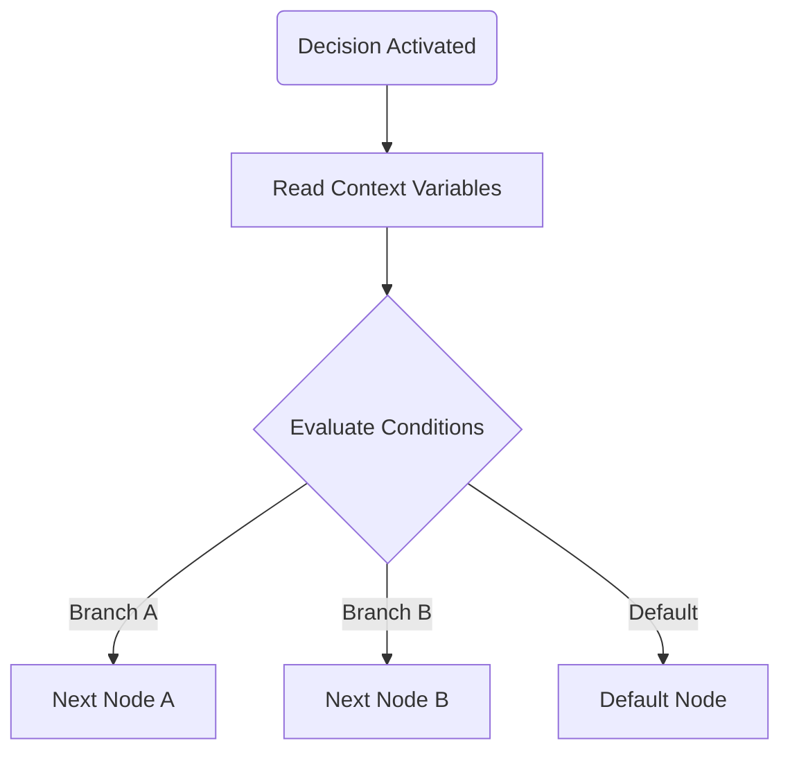
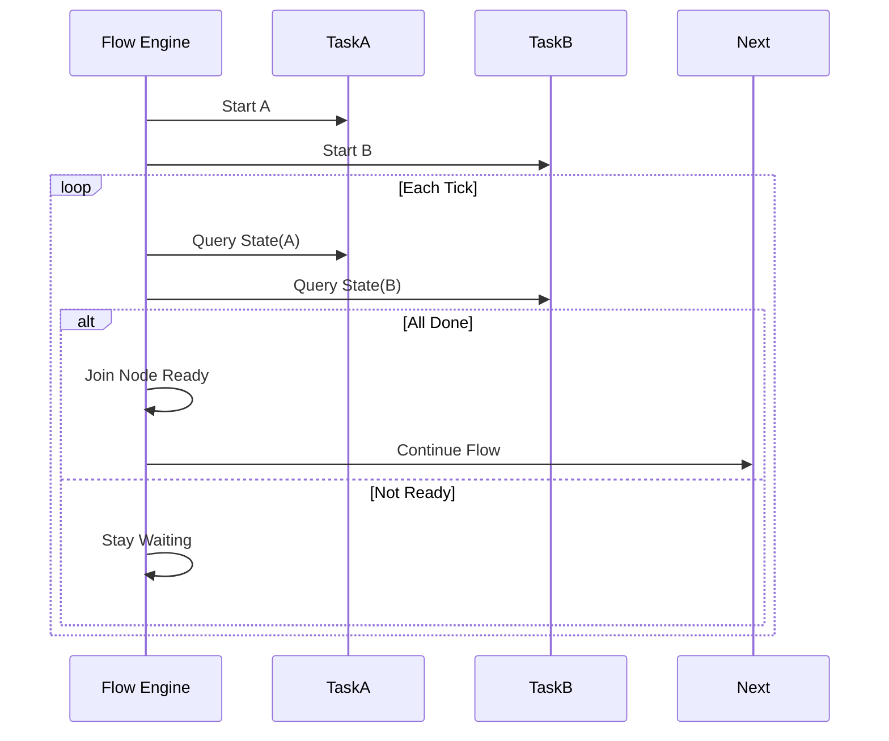

# Graph Logic Engine Implementation Principles & Algorithms

## 1. 概述 (Overview)

本文档详细阐述了 Graph Logic Engine 的核心实现原理与运行时算法。本引擎旨在提供一个跨平台、确定性、强一致性的逻辑执行环境，特别适用于工业控制与机器人场景。

## 2. 核心架构原理 (Core Principles)

### 2.1 确定性执行模型 (Deterministic Execution Model)
引擎采用 **固定时间片 (Time-Triggered)** 的调度策略。
- **Tick**: 逻辑执行的原子单位（默认 10ms）。
- **同步**: 所有逻辑计算在 Tick 内完成，输入在 Tick 开始时采样，输出在 Tick 结束时提交。

### 2.2 双缓冲状态管理 (Double Buffer State Management)
为了保证并行逻辑的一致性（避免 Read-Your-Writes 问题），引擎内部变量采用双缓冲机制：
- **Current Buffer**: 只读，存储上一 Tick 提交的状态。
- **Next Buffer**: 只写，存储当前 Tick 计算的新状态。
- **Commit**: Tick 结束时，原子性地交换 Buffer 或应用 Delta。

### 2.3 宿主隔离 (Host Isolation)
引擎核心（VM）不直接访问硬件，而是通过 **Host Binding Interface** 交互：
- **External Snapshot**: 外部 IO/系统状态的只读副本。
- **Action Command Queue**: 异步动作请求队列。

## 3. 运行时算法 (Runtime Algorithms)

### 3.1 主循环算法 (Main Loop Algorithm)
引擎的主循环严格遵循以下时序：

```python
def engine_main_loop():
    while True:
        wait_for_next_tick_signal() # 由硬件定时器触发 (100Hz)
        
        # 1. Atomic Input
        snapshot = host_read_snapshot()
        
        # 2. VM Execution
        vm_execute_tick(snapshot)
        
        # 3. Atomic Output
        host_write_outputs()
```

### 3.2 状态机实现算法 (FSM Implementation)
状态机是逻辑引擎的核心应用模式。VM 通过内部整型变量 (`_stm_state`) 配合分发逻辑来实现 FSM。

#### 3.2.1 状态机模型 (Model Structure)
一个标准的状态机包含状态 (State)、转换 (Transition) 和动作 (Action)。

> **示例语义说明**:
> *   **IDLE (空闲态)**: 设备处于待机模式。此状态下的主要逻辑是**等待启动信号** (如按下启动按钮或传感器触发)。
> *   **RUNNING (运行态)**: 设备处于工作模式。此状态下的主要逻辑是**执行具体动作** (如电机转动) 并**检测停止信号**。



#### 3.2.2 单 Tick 执行流程 (Single Tick Execution Flow)
每个 Tick 内，FSM 的执行遵循“读取-分发-执行-写入”的流程：



#### 3.2.3 跨 Tick 状态迁移时序 (Cross-Tick Transition Timing)
由于采用了双缓冲机制，状态的改变不会立即生效，而是延迟到下一个 Tick。这保证了在同一个 Tick 内，无论逻辑多么复杂，读取到的状态始终是稳定的。



#### 3.2.4 算法伪代码 (Algorithm Pseudo-code)
```python
# 编译后的状态机逻辑结构
def fsm_tick():
    # 1. 读取当前状态 (从 Current Buffer)
    current_state = LOAD_INT(_stm_state)
    
    # 2. 状态分发
    match current_state:
        case STATE_IDLE:
            # [IDLE 状态逻辑]: 等待启动信号
            # 此时设备停止，只检测转换条件
            
            # 2.2 转换检查 (Transition Check)
            if LOAD_EXT(sensor_start) == True:
                # 满足启动条件 -> 切换到运行态
                # 写入下一状态 (到 Next Buffer)
                # 注意：转换在当前 Tick 不生效，下一 Tick 才生效
                STORE_INT(_stm_state, STATE_RUNNING)
                return

        case STATE_RUNNING:
            # [RUNNING 状态逻辑]: 执行工作任务
            
            # 2.1 执行动作 (Action)
            CALL_ACTION(MOVE_FORWARD)
            
            # 2.2 转换检查 (Transition Check)
            if LOAD_EXT(sensor_stop) == True:
                # 满足停止条件 -> 回到空闲态
                STORE_INT(_stm_state, STATE_IDLE)
                return
```

### 3.3 动作调度算法 (Action Scheduling)
动作 (Action) 通常是耗时的（如电机运动），不能阻塞 Tick。

1.  **Emit**: VM 执行 `CALL_ACTION`，将命令推入 Host 的命令队列。
2.  **Async Exec**: Host 在 Tick 之外（或独立线程/中断）处理命令。
3.  **Feedback**: Host 通过 External Variables 更新动作状态 (Done/Error/Running)。
4.  **Wait**: VM 执行 `WAIT_ACTION` 或轮询状态变量，决定是否继续执行。

## 4. 能力契约模型 (Capability Contract Model)

### 4.1 能力的角色与定位
Graph Logic Engine 中的“能力 (Capability)”指的是已经在底层实现并封装完备的一段功能，例如：
- 机械臂移动到某个姿态 (MoveToPose)
- 抓取工件 (PickObject)
- 执行扫码 (ScanQRCode)

这些能力负责承载细粒度控制与内部状态机，对图形逻辑引擎暴露统一的“能力契约”，使编排层只需关心：
- 何时触发某个能力；
- 它何时结束 (Done/Error/Timeout)；
- 结束后的结果是什么 (result_code / result_data)。

### 4.2 标识与版本 (Identity & Version)
每个能力都必须具备稳定的标识与版本信息：
- `id`: 能力唯一标识，例如 `"MoveToPose"`, `"PickObject"`, `"ScanQRCode"`。
- `version`: 能力版本号，例如 `"1.0.0"`, `"2.1.3"`。

这两者用于在不同设备、固件版本与部署环境之间对齐同一能力的语义，以保证图层编排逻辑在跨平台时具有稳定行为。

### 4.3 输入接口 (Parameters)
能力通过一组参数对外提供配置接口，典型字段包括：
- `name`: 参数名，例如 `target_pose`, `speed_mode`, `recipe_id`。
- `type`: 参数类型，例如 `int`, `float`, `bool`, `string`, `Pose`, `Enum`。
- `required`: 是否必填。
- `default`: 默认值（可选）。
- `description`: 参数用途说明（给人阅读）。

在图层中，这些参数对应 Task 节点上的“输入插槽”，可以连接：
- 常量；
- 外部变量 (External Snapshot 中的字段)；
- 上游 Task 暴露出的 `result_code` / `result_data` 等输出。

### 4.4 生命周期状态 (Lifecycle States)
对编排层而言，每个能力都有一套统一的粗粒度生命周期状态：
- `Idle`: 尚未启动，或执行完毕并已复位，可以再次启动。
- `Running`: 正在执行内部流程（准备、执行、收尾等内部子状态对编排层透明）。
- `Done`: 正常完成，结果可用。
- `Error`: 执行失败，结果不可用或需要人工介入。
- `Timeout`: 超过约定时间仍未完成。
- `Cancelled`: 被上层主动取消。

> 注意：能力内部可以有更细致的子状态机，但对 Graph Logic Engine 的编排层仅暴露上述生命周期枚举。

### 4.5 结果与诊断 (Result & Diagnostics)
能力执行结束后会给出结果与诊断信息：
- `result_code`: 结果码，用于编排层 Decision 节点分支。例如 `"OK"`, `"NO_OBJECT"`, `"GRIP_FAIL"`, `"VISION_LOST"`。
- `result_data`: 结构化结果数据（可选），例如扫码文本、测量值、统计信息等。
- `diagnostics`: 诊断信息（可选），例如内部错误码、日志片段，主要用于工程调试与问题排查。

可以为 `result_code` 定义一个枚举列表，每个条目包含：
- `code`: 结果码字符串，如 `"OK"`；
- `category`: 结果类别，如 `success` / `recoverable_error` / `fatal_error`；
- `description`: 人类可读的解释。

### 4.6 约束与资源 (Constraints & Resources)
能力契约中还可以声明自身的约束与资源使用情况：
- `recommended_timeout_ms`: 推荐超时时间，编排层可直接采用或覆写。
- `resources`: 运行此能力时占用的资源集合，例如 `["arm_A", "gripper_1", "camera_1"]`。
- `reentrancy`: 重入与并发策略，例如 `"single_instance"`（全局只能有一个实例运行）、`"multi_instance"`（允许多个实例并发）。

这些信息为编排层的资源冲突预检查、互斥控制与超时策略提供依据。

### 4.7 能力生命周期示意图 (Mermaid)
下图展示了一个能力在对外暴露层面的生命周期：



内部更细致的子状态（例如 Preparing、Executing、Finishing）被隐藏在 `Running` 状态内部，对编排层保持透明。

### 4.8 能力契约示例 (Capability Contract Example)
下面给出一个能力契约的结构化示例，仅用于说明字段含义：

```text
Capability: MoveToPose
- id: "MoveToPose"
- version: "1.0.0"
- inputs:
  - name: "target_pose", type: Pose, required: true
  - name: "speed_mode", type: Enum(SLOW, NORMAL, FAST), required: false, default: NORMAL
- lifecycle_states: [Idle, Running, Done, Error, Timeout]
- result_codes:
  - { code: "OK", category: "success" }
  - { code: "OUT_OF_RANGE", category: "recoverable_error" }
  - { code: "COLLISION_RISK", category: "fatal_error" }
- recommended_timeout_ms: 5000
- resources: ["arm_A"]
- reentrancy: "single_instance"
```

Graph Logic Engine 的图层仅依赖此类契约进行流程编排，不关心能力内部的具体实现。

## 5. 图层节点语义 (Graph Nodes Semantics)

### 5.1 概览
图层的主要职责是对“能力”进行时序与条件上的编排，而非实现细粒度控制逻辑。为此，引擎提供三类基础图节点：
- Task 节点：对某个能力发起一次调用并等待其完成；
- Decision 节点：基于当前上下文做条件判断与分支；
- Join/Wait 节点：在并行执行的多个 Task 之间做等待与汇合。

这些节点全部建立在能力契约之上，通过统一的生命周期状态与结果码完成流程驱动。

### 5.2 Task 节点 (Capability Task Node)

#### 5.2.1 输入与输出
Task 节点绑定某个能力 ID，并为该能力提供参数输入与结果输出：
- 输入：
  - 目标能力 ID（例如 `"MoveToPose"`）；
  - 参数映射：将图中的变量、常量或上游 Task 输出映射到能力的参数；
  - 可选超时时间：若未指定，则采用能力契约中的 `recommended_timeout_ms`。
- 输出（出边）：
  - `onDone`: 当能力进入 Done 状态时激活；
  - `onError`: 当能力进入 Error 状态时激活；
  - `onTimeout`: 当能力进入 Timeout 状态时激活（可选）。

Task 节点还会将最近一次调用的 `result_code` 与 `result_data` 暴露为可读变量，供后续 Decision 或其它节点使用。

#### 5.2.2 Tick 级时序语义
在 Tick 驱动的执行模型下，一个 Task 节点的行为可以概述为：
- Tick N：
  - Task 被图层激活；
  - 收集所有输入参数的当前值；
  - 触发绑定能力从 Idle 进入 Running；
  - Task 自身进入“等待中”状态，本 Tick 不会继续触发后续节点。
- Tick N+1, N+2, ...：
  - 每个 Tick 检查能力的 `lifecycle_state`；
  - 若仍为 Running，则继续等待；
  - 一旦状态变为 Done / Error / Timeout：
    - Task 标记自身为“完成”；
    - 选择对应的出口（onDone/onError/onTimeout）激活下游节点。

#### 5.2.3 Task 节点流程图 (Mermaid)

```mermaid
flowchart TD
    Start(Task Activated) --> Collect[Collect Inputs & Bind Capability]
    Collect --> Trigger[Start Capability (Idle -> Running)]
    Trigger --> WaitState{Capability State?}
    WaitState -->|Running| WaitTick[Wait Next Tick]
    WaitTick --> WaitState
    WaitState -->|Done| OutDone[onDone]
    WaitState -->|Error| OutError[onError]
    WaitState -->|Timeout| OutTimeout[onTimeout]
```

#### 5.2.4 Task 节点伪代码示例

```python
def execute_task_node():
    if just_activated():
        params = collect_inputs()
        capability_start(id="MoveToPose", params=params)
        return  # 本 Tick 结束，等待下一个 Tick

    state = capability_get_state("MoveToPose")
    if state == "Running":
        return  # 继续等待

    if state == "Done":
        route_to("onDone")
    elif state == "Error":
        route_to("onError")
    elif state == "Timeout":
        route_to("onTimeout")
```

### 5.3 Decision 节点 (Decision Node)

#### 5.3.1 输入与输出
Decision 节点用于基于当前上下文作出分支决策：
- 输入：
  - 一组条件表达式，例如：
    - `WorkpieceExist == true`
    - `last_task.result_code in ["GRIP_FAIL", "NO_OBJECT"]`；
  - 可读取变量：
    - 外部变量 (External Snapshot)；
    - 上游 Task 暴露的 `result_code` / `result_data` 等。
- 输出：
  - 多个命名出口，例如 `true` / `false`，或 `Success` / `Retry` / `Abort` 等。

#### 5.3.2 Tick 级语义
Decision 节点在被激活的同一 Tick 内完成所有读取与计算：
- 读取当前上下文中的变量；
- 计算条件表达式；
- 立即选择一条出口激活后续节点；
- 不持有跨 Tick 的内部状态，也不触发任何能力调用。

#### 5.3.3 Decision 节点流程图 (Mermaid)



#### 5.3.4 Decision 节点伪代码示例

```python
def execute_decision_node():
    ctx = read_context()
    if ctx["WorkpieceExist"]:
        route_to("HasWorkpiece")
    else:
        route_to("NoWorkpiece")
```

### 5.4 Join/Wait 节点 (Join / Wait Node)

#### 5.4.1 模式定义
Join/Wait 节点用于并行 Task 的结果聚合，常见模式包括：
- `WaitAllDone`: 所有指定 Task 都处于 Done 状态时才放行；
- `WaitAnyDone`: 任意一个 Task 进入 Done 状态即可放行；
- `WaitAllFinished`: 所有 Task 均进入终态 (Done/Error/Timeout) 后放行。

#### 5.4.2 Tick 级语义
- 初次激活时：
  - 记录需要监听的 Task 列表；
  - 立即检查当前是否已经满足条件（例如有些 Task 早已完成）；
  - 若条件不满足，则节点保持“等待中”，本 Tick 不向后续节点流转。
- 随后的每个 Tick：
  - 检查列表中各 Task 的 `lifecycle_state`；
  - 一旦满足模式条件：
    - 将自身标记为“完成”；
    - 在当前 Tick 内激活后续节点（例如 `onReady` 或 `onFailed`）。

#### 5.4.3 Join/Wait 节点时序图 (Mermaid)



#### 5.4.4 Join/Wait 节点伪代码示例

```python
def execute_join_node(task_ids, mode):
    states = {tid: capability_get_state(tid) for tid in task_ids}

    if mode == "WaitAllDone":
        if all(s == "Done" for s in states.values()):
            route_to("onReady")
    elif mode == "WaitAnyDone":
        if any(s == "Done" for s in states.values()):
            route_to("onReady")
    elif mode == "WaitAllFinished":
        if all(s in ["Done", "Error", "Timeout"] for s in states.values()):
            route_to("onReady")
```

## 6. 编译器映射 (Compiler Mapping)

编译器将图形化逻辑转换为字节码时，遵循以下映射规则：

- **Start Node** -> Entry Point
- **State Node** -> Case Block in Dispatcher
- **Transition Line** -> Conditional Jump & Store Next State
- **Variable** -> Symbol Table Entry (Internal/External)

详细的字节码规范请参考 [Bytecode VM Spec](./bytecode-vm-spec.md)。
